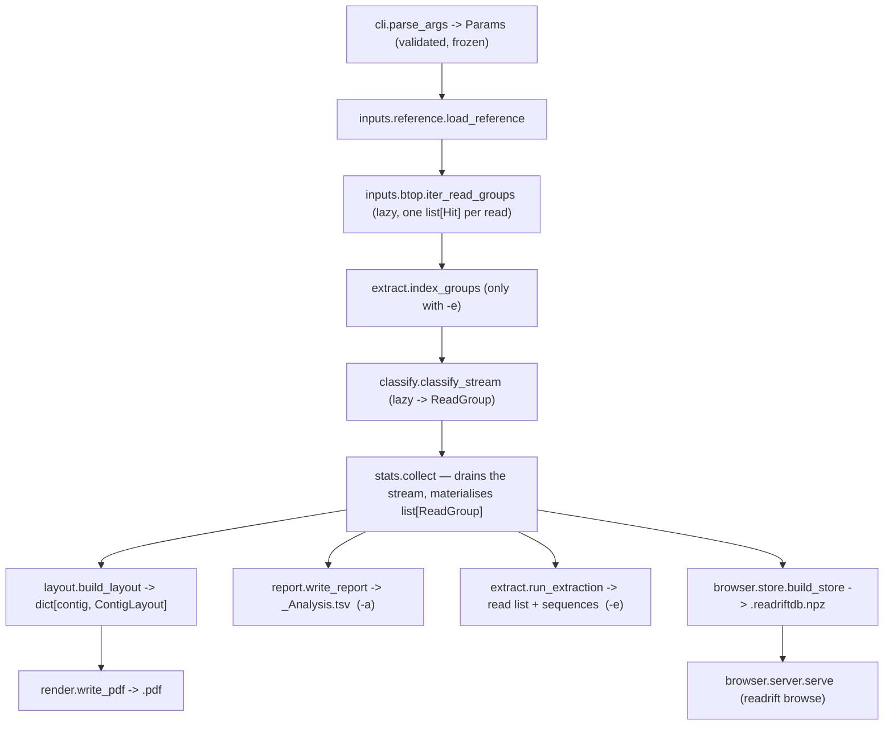

# `readrift` — Code Structure

**Package:** `readrift` 1.0.0 · Python ≥ 3.10 · matplotlib + numpy
**Scope of this document:** what the code in `readrift/` does today, module by module, and the algorithms and invariants a maintainer has to respect.

Companion documents: `README.md` (how to use it), `CHANGES.md` (how the output differs from the `legacy/read_print_23.pl` original), `legacy/port_plan.md` (the audit of that original and the plan this package was built from — historical, not maintained).

---

## 1. What the program is

Given

- a **reference** sequence (GenBank `.gb` or FASTA `.fa`, optionally gzipped), and
- a **BLAST alignment** of long reads (Oxford Nanopore / PacBio) against it, in BLAST's tabular `BTOP` format,

`readrift` classifies every read by *how it maps* — contiguously, or divided into pieces — and draws a wide-format, multi-page map: the reference as an x-axis, every read as a horizontal line above (plus strand) or below (minus strand) it, with arrowheads and colour encoding the kind of discontinuity. The PDF is written directly by matplotlib; there is no PostScript stage and no Ghostscript.

Reads whose pieces map far apart, in opposite orientation, or onto a different contig are evidence of **structural variation, inversions, transposition, phage excision or circularity**. The map makes them visible as a class rather than one at a time.

```bash
python -m readrift AP027148.gb DRR325755.btop -x 10        # -> DRR325755.pdf + .readriftdb.npz
python -m readrift browse DRR325755.readriftdb.npz          # -> interactive genome browser
```

Every normal run also writes a `.readriftdb.npz` cache so the browser never has to re-read the BTOP file.

### 1.1 Input record contract (BTOP columns)

Produced by NCBI BLAST+, which ReadRift requires but neither installs nor runs:

```bash
makeblastdb -in ref.fa -dbtype nucl -out refdb
blastn -db refdb -query reads.fa -out reads.btop \
  -outfmt "6 qseqid sframe qstart qend sstart send qlen sseqid btop"
```

The `-outfmt` string is `inputs/btop.py:OUTFMT`, and `--help` and the unparsable-file error below both print it from there. The string deliberately has no `delim=`. Tab is already BLAST's default separator for format 6, and BLAST does not interpret `delim=\t`: it writes the two characters `\` `t` between columns (checked against BLAST+ 2.13.0), so every line fails. Until this was corrected, `--help` printed exactly that command. `tests/test_inputs.py:test_documented_outfmt_has_no_delim` keeps the string and the help text in step.

Parsed by `inputs/btop.py:parse_line`, which splits on tab and nothing else. Minimum 8 columns; extras past index 8 are ignored.

| Idx | BLAST field | Meaning | Validation |
|-----|-------------|---------|------------|
| 0 | `qseqid` | read name — the grouping key, never rewritten | verbatim |
| 1 | `sframe` | strand | must be exactly `1` or `-1` |
| 2 | `qstart` | match start in the read | int |
| 3 | `qend` | match end in the read | int |
| 4 | `sstart` | match start on the reference (`> send` on the minus strand) | int |
| 5 | `send` | match end on the reference | int |
| 6 | `qlen` | total read length | int |
| 7 | `sseqid` | reference accession / contig | resolved later against the reference |
| 8 | `btop` | alignment trace string | **optional**, defaults to `""` |

One read produces one or more lines (HSPs). Lines for the same read are expected to be **consecutive**, which is how BLAST writes them; grouping is by consecutive equal `qseqid`. A read name that reappears in a later block is counted in `BtopStats.out_of_order` and reported as a note, not silently merged.

Malformed lines are counted and skipped. Blank lines and `#` comments are ignored. A malformed line on its own is never fatal, but a file in which **no** line parses (or which has none) is. `BtopStats.nothing_parsed` is `malformed == lines`; after the stream is drained, `analyse` prints `BtopStats.explain_nothing_parsed()` and exits 2 (stage 6b, §3). The explanation recognises the two commonest mistakes from the first rejected line, which is kept in `BtopStats.first_malformed`: a literal `\t` means `delim=\t`, and a leading `BLAST` means BLAST's pairwise report, i.e. no `-outfmt`. Both messages end with the correct command. Before this check, such a file finished with exit 0 and an empty map, because the accession cross-check (stage 7) never saw an accession to fail on. Lines dropped by `--min-read-length` *were* parsed, so a file of short reads is not this case.

---

## 2. Package layout

```
readrift/
├── __init__.py       main() — entry point and `browse` subcommand dispatch
├── __main__.py       python -m readrift
├── cli.py            argparse, built from the same option table the front page reads
├── params.py         OPTIONS table + the frozen, resolved Params
├── models.py         Hit, ReadGroup, Contig, Annotation, Metadata, Segment, ...
├── labels.py         short display names for reads
├── inputs/           btop, fasta, genbank, reference (dispatch), reads (FASTA/FASTQ/gz)
├── classify.py       HSP selection and read classification    <- the science
├── btop_trace.py     BTOP alignment-string parser (identity)
├── layout.py         lane packing and page splitting
├── stats.py          counts, coverage, figure inputs
├── extract.py        -e region extraction (index + pull reads back out)
├── report.py         the analysis TSV
├── render/
│   ├── __init__.py     write_pdf — PDF assembly
│   ├── theme.py        colours, fonts, arrow geometry   <- single source of truth
│   ├── mapfig.py       one page of the read map
│   ├── frontpage.py    parameters, legend, project info, statistics, provenance
│   └── plots.py        figures 1–7
├── browser/
│   ├── store.py        the .readriftdb.npz cache: build, open, query by region
│   ├── region.py       one window, packed into lanes   <- shared by API and export
│   ├── server.py       stdlib HTTP server, loopback only
│   ├── export.py       the region on screen -> PDF/PNG
│   └── static/         index.html, app.js, style.css (canvas front end)
└── pipeline.py       orchestration
```

Import direction is strictly downward: `pipeline` → everything; `render/` and `browser/` never import each other except `browser/export.py` and `browser/server.py` reading `render/theme.py` for the palette. matplotlib is imported **inside** `render.write_pdf` and `browser.export`, so `--help` and a plain `browse` session do not pay for it.

---

## 3. Execution pipeline



Stage by stage (`pipeline.py`):

| # | Stage | Where | Produces |
|---|---|---|---|
| 0 | Entry, subcommand dispatch | `readrift/__init__.py:14` | `run()` or `browse()` |
| 1 | Parse + validate | `readrift/cli.py:161`, `readrift/params.py:325` | frozen `Params`; `SystemExit("ERROR: …")` on a bad file or impossible geometry |
| 2 | Reference | `readrift/inputs/reference.py:79` | `Reference` — contigs longest-first, annotations, metadata, alias map |
| 3 | BTOP stream | `readrift/inputs/btop.py:111` | lazy `Iterator[list[Hit]]`, reads shorter than `-r` already dropped |
| 4 | Extraction index (only `-e`) | `readrift/extract.py:78` | the same iterator, indexing each `Hit` as it passes |
| 5 | Classification | `readrift/classify.py:231` | lazy `Iterator[ReadGroup]` |
| 6 | **Statistics — this is what drains 3–5** | `readrift/stats.py:186` | `(Stats, list[ReadGroup])` |
| 6b | BTOP sanity check | `readrift/pipeline.py:126` | exit code 2 if no line of the file parsed, with the reason and the correct `-outfmt` (§1.1) |
| 7 | Accession cross-check | `readrift/pipeline.py:134` | exit code 2 if *no* accession resolved, unless `--allow-unknown-contigs` |
| 8 | Layout | `readrift/layout.py:296` | `dict[str, ContigLayout]`; lane overflow appended to `notes` |
| 9 | PDF | `readrift/render/__init__.py:37` | `<out>.pdf` (skipped by `--no-pdf`) |
| 10 | Analysis TSV | `readrift/report.py:51` | `<out>_Analysis.tsv` (only with `-a`) |
| 11 | Read extraction | `readrift/extract.py:88` | `extract-reads-list_<contig>_<start>_<end>.txt` + `.fastq`/`.fasta` |
| 12 | Browser cache | `readrift/browser/store.py:171` | `<out>.readriftdb.npz` (skipped by `--no-cache`) |
| 13 | Console summary | `readrift/pipeline.py:277` | class counts, coverage, N50, notes, elapsed time |

Ordering constraints that matter:

- `analysis.index` is only complete **after** stage 6 has drained the stream. Never query it earlier.
- The cache is written **last**, deliberately: a cache failure must not cost a PDF that took minutes. `write_cache` swallows exceptions and warns (it re-raises under `-d/--debug`).
- `notes` is one list object shared by `analyse`, `run` and the cache, so the lane-overflow note reaches the front page *and* the browser panel.

`pipeline.analyse(params) -> Analysis` is the whole expensive front half (`Reference`, `Stats`, `list[ReadGroup]`, `notes`, optional `ReadIndex`). Everything downstream — PDF, TSV, extraction, cache — derives from `Analysis` and nothing else, which is why `browse` can reuse it unchanged.

`browse` (`readrift/pipeline.py:319`): with a cache path it goes straight to `BrowserStore.open`; with reference + BTOP it tries to reuse `<out>.readriftdb.npz`, checks `is_stale(params)`, rebuilds with a printed reason if needed (or unconditionally with `--rebuild`), then calls `browser.server.serve`. Stages 8–11 never run — `parse_browse_args` forces `no_pdf=True`.

---

## 4. Data model (`models.py`)

No I/O, no science, no drawing. Every type here is a contract between `inputs/`, `classify`, `layout`, `stats`, `render/` and `browser/`.

### `Hit` — one BTOP line = one HSP (frozen)

`read`, `strand` (±1), `qstart`, `qend`, `sstart`, `send`, `qlen`, `contig`, `btop`.
`contig` is rewritten to the canonical reference name by `classify_stream`; nothing else is ever modified.

Derived properties: `qlow`/`qhigh`, `qspan`, `slow`/`shigh`, `sspan`. Spans are *differences*, not inclusive base counts.

### `ReadClass` / `Junction` — the two enums

| `ReadClass` | Meaning |
|---|---|
| `UNDIVIDED` | one surviving HSP — the read maps contiguously |
| `SHORT_DIVIDED` | several HSPs, reference span ≈ read span (indels, small rearrangements) |
| `LONG_DIVIDED` | several HSPs separated by more reference than the read accounts for |

| `Junction` | Value | Meaning |
|---|---|---|
| `PLAIN` | `"C"` | ordinary junction |
| `CIRCLE` | `"Circle"` | the read's footprint is essentially the whole replicon — it bridges the origin |
| `CONTIG_JOIN` | `"Contig_Join"` | pieces land on different contigs |

### `ReadGroup` — one read after selection and classification (mutable)

`read` (original name), `label` (display name), `hits: list[Hit]` in file order, `cls`, `junction`, `distance`, `inverted`, `truncated`.

Properties: `contig`, `strand`, `qlen` (all from `hits[0]`), `matched_bases` = `sum(h.sspan)` — **the project-wide definition of coverage**: reference a divided read jumps over is not covered — plus `ref_low`/`ref_high`.

`junction` and `inverted` are decided once, at classification time, never at draw time.

### Reference types

- `Contig(name, length)` — only the length is ever needed; sequence content is never retained.
- `Annotation(contig, strand, start, end, feature, name, group, product="", locus_tag="", note="")` — `group` ∈ `""`, `RNA`, `phage`, `IS`, `hyp`, `pseudo`. The first seven fields are what a map page draws; the last three are the qualifiers the browser's feature panel answers "what *is* this gene?" with. `product` was already being read to decide `group` and then discarded.
- `Metadata(organism, bio_project, bio_sample, sra, assembly_method, sequencing_technology, source_format, first_line)` — every field defaults to `""`, never `None`. `rows()` returns the non-empty `(label, value)` pairs for the front page.
- `Reference(contigs, annotations, metadata, aliases)` (`inputs/reference.py`) — sorts contigs **longest first, then by name** (that is the page order) and owns `resolve(name)`, the single point where a BTOP `sseqid` becomes a canonical contig name.

### Layout types (produced by `layout.py`, consumed by `render/mapfig.py`)

`SegmentKind` (`READ` | `INVERSION`), `Segment(page, x0, x1, y, kind, cls)`, `Marker(page, x, y, style, cls)`, `Label(page, x, y, text, cls)`, `PlacedRead(group, lane, segments, markers, labels)`, `ContigLayout(contig, pages, placed, overflow)`.

Marker styles: `arrow_fwd`, `arrow_rev`, `arrow_plain`, `arrow_ct`, `arrow_circular`, `tick`, `inversion_arrow`.

---

## 5. The classification algorithm

`classify.py` is the scientific core. Everything else can be rewritten; this is the part whose output is the result. Golden tests in `tests/test_classify.py` fix its behaviour on a hand-derived dataset — if they change, the science changed, and that needs an entry in `CHANGES.md`.

```python
collapse_repeats(hits) -> list[Hit]
select_non_overlapping(hits, tolerance) -> (list[Hit], dropped)
drop_fold_back(hits, min_overlap) -> (list[Hit], dropped)
select_hits(hits, params) -> (kept, dropped_short, dropped_overlap, dropped_fold_back)
classify_hits(kept, label, contig_lengths, params) -> ReadGroup|None
classify_stream(groups, reference, params, labeller, stats) -> Iterator[ReadGroup]
drawable_hits(group, params) -> list[Hit]
```

**Step 0 — read-length pre-filter** (upstream, `inputs/btop.py:140`). Lines with `qlen < min_read_length` never reach classification. → `-r` (default 10 000).

**Step 1 — contig resolution.** `reference.resolve(hit.contig)` per HSP; on a miss the accession is recorded in `ClassifyStats.unknown_contigs` and the HSP is dropped; if nothing resolves the read is skipped. A run where *no* accession resolves is a hard error (exit 2) unless `--allow-unknown-contigs`. Resolution covers version suffixes both ways (`ctgA` ↔ `ctgA.1`).

**Step 2 — per-HSP length filter.** Keep HSPs with `qspan > params.hsp_cut`. → `--min-hsp-length` (default 100), forced to 100 by `--compat`.

**Step 3 — repeat collapse** (`collapse_repeats`). Only with ≥ 3 HSPs. Walking `j = 1…n-1` with `origin = hits[0].sstart`: when `j ≥ 2` and two consecutive HSPs cover almost the same stretch of the *read* (`|prev_span − span| < REPEAT_SPAN_TOLERANCE`, 50), they are competing placements of one repeat; the closer one to the origin wins and overwrites slot `j-1`. The duplicate this leaves is discarded by step 4. `REPEAT_SPAN_TOLERANCE` is a module constant, not a CLI option.

**Step 4 — greedy non-overlapping selection** (`select_non_overlapping`). Walk the HSPs in **file order**, keeping a list of claimed query intervals:

1. `lo, hi = hit.qlow, hit.qhigh`.
2. Any overlap with a claimed interval → drop the HSP.
3. Otherwise keep it and claim `[floor(lo + tol), floor(hi − tol)]` — the inset margin lets a short repeat shared by two junctions be re-used by both.
4. The interval is claimed only when `start ≤ end`; when the tolerance exceeds half the HSP length nothing is claimed, but the HSP is still kept.

`tol = params.junction_tolerance = micro_match_length / 4` → `-y` (default 100 ⇒ tol 25). Interval arithmetic, not a per-base array: O(kept) per HSP instead of O(read length).

**Step 4b — fold-back removal** (`drop_fold_back`). The one step in this module that is *not* in the Perl. A read sequenced through its template and back along it — adapter or end ligation joining the molecule to its own reverse complement — maps as one long HSP followed by a run of HSPs re-reading the same reference backwards. Step 4 cannot see it: those HSPs claim **fresh read bases**, so all of them are legitimately kept; it is the *reference* that is covered twice.

Walking in file order, an HSP is dropped when **both**:

1. it runs opposite to `hits[0].strand` — file order makes the first HSP the anchor, as BLAST writes its best HSP first and every other step here already relies on that; and
2. at least `FOLD_BACK_OVERLAP` (0.5) of its reference span is already covered by the union of HSPs kept for this read **on the same contig**.

Both halves are load-bearing: the strand test alone deletes genuine inversions, the overlap test alone deletes genuine tandem duplications, and the threshold is a majority rather than a small tolerance because inversions in real genomes often occur between inverted repeats — a read crossing a real breakpoint can share a few hundred bases of reference with the piece before it and must survive. Counted in `ClassifyStats.hits_dropped_fold_back` / `reads_folded_back` and reported as a front-page note. → `--keep-fold-back` disables the step entirely. See `CHANGES.md` §1.8.

**Step 5 — trivial cases.** No HSPs → `None` (counted as `reads_without_hits`). One HSP → `UNDIVIDED`, `PLAIN`, `distance = 0`, not inverted.

**Step 6 — spans and the division distance.**

```
map_min/map_max   = min slow / max shigh over kept
read_min/read_max = min qlow / max qhigh over kept
distance = abs((map_max - map_min) - (read_max - read_min))
```

`distance` is how much reference the read skips relative to its own length.

**Step 7 — junction kind**, in this order:

1. `CONTIG_JOIN` if any HSP after the first is on a different contig;
2. else `CIRCLE` if the contig length is known and `|length − (map_max − map_min)| < CIRCLE_TOLERANCE` (20);
3. else `PLAIN`.

**Step 8 — short vs long.** `SHORT_DIVIDED` if `distance < params.division_cut`, else `LONG_DIVIDED`. `division_cut` = `--division-threshold` when given, otherwise `-m/--min-match-length` (default 2 000).

**Step 9 — inversion.** `inverted = any(h.strand != kept[0].strand)`. Once per read, for all divided classes.

**Step 10 — labelling.** `LabelAssigner.label(read)` (`labels.py`) turns `DRR325755.12345` into the display-only `R_12345` via `\w+[._](\d+)`, falls back to `R#<n>` for names that miss the pattern (ONT UUIDs), and disambiguates collisions with `~n`. **The read name itself is never rewritten**; unmatched and collided counts become front-page notes.

**Step 11 — coverage accounting and `--cov-max`.** `coverage_used += qlen / reference.total_length` after each read. When `cov_max` is non-zero and the total passes it, the current group is marked `truncated`, yielded, and the generator stops. → `-x` (default 0 = unlimited).

**Step 12 — drawable segment filter** (`drawable_hits`). For `LONG_DIVIDED` reads only, HSPs with `sspan ≤ min_match_length` are hidden from the map so short anchors either side of a junction do not clutter it. They still count towards coverage — they are matched bases. The browser applies the same cut at draw time (`browser/region.drawn_segment_minimum`, §11.2), so a region on screen shows the same pieces as the matching slice of the poster.

### Thresholds, and what controls each

| Threshold | Value / default | Control |
|---|---|---|
| Read length cut | 10 000 | `-r --min-read-length` |
| HSP query-span cut | 100 | `--min-hsp-length` (forced to 100 by `--compat`) |
| Repeat span tolerance | 50 | hardcoded (`classify.py:31`) |
| Junction claim tolerance | `micro_match_length / 4` = 25 | `-y --micro-match-length` |
| Short/long divided cut | 2 000 | `--division-threshold`, else `-m --min-match-length` |
| Circularity tolerance | 20 | hardcoded (`classify.py:35`) |
| Fold-back reference overlap | 0.5 | hardcoded (`FOLD_BACK_OVERLAP`); the step itself is switched off by `--keep-fold-back` |
| Drawn-segment minimum | 2 000 | `-m --min-match-length` |
| Coverage stop | 0 (unlimited) | `-x --cov-max` |
| Unknown-accession policy | fatal | `--allow-unknown-contigs` |

`ClassifyStats` accumulates `reads_in`, `reads_classified`, `reads_without_hits`, `hits_dropped_short`, `hits_dropped_overlap`, `hits_dropped_fold_back`, `reads_folded_back`, `unknown_contig_reads`, `unknown_contigs`, `coverage_used`, `truncated_by_cov_max`; `warnings(reference)` renders them for the front page and the console.

### `btop_trace.py`

A BTOP string is a flat sequence of two token kinds with no separators: a run of digits (that many identical positions) and a pair of characters (one non-matching column: `AG` mismatch, `-A` query gap, `A-` subject gap). `parse(btop) -> Trace(matches, mismatches, query_gaps, subject_gaps)` with `aligned_columns`, `identity` and `mismatch_rate` properties. Unrecognised text is ignored — a malformed trace never stops a run.

Consumers, both gated on `--identity`: `stats.collect` (per-read identity for figure 6) and `browser/store.build_store` (per-HSP identity in the cache).

---

## 6. Input layer (`inputs/`)

| Module | Parses | Returns |
|---|---|---|
| `reference.py` | dispatch | `sniff_format` (first non-blank line: `>` → fa, `LOCUS` → gb, anything else → `SystemExit` quoting the line), `load_reference` → `Reference` |
| `fasta.py` | FASTA | `(list[Contig], Metadata, aliases)` |
| `genbank.py` | GenBank | `(list[Contig], list[Annotation], Metadata, aliases)` |
| `btop.py` | BTOP | `Iterator[list[Hit]]` + `BtopStats`; `OUTFMT`, the one `-outfmt` string (§1.1) |
| `reads.py` | FASTA/FASTQ | `Iterator[(read_id, verbatim record text)]` |

Gzip is handled in-process by suffix (`.gz` → `gzip.open(..., "rt")`) in every one of them; no subprocess, no `seek`.

**FASTA.** Accession = first token after `>`; if it contains `|`, the **last** non-empty pipe field wins (`>gi|12345|ref|NC_000913.3|` → `NC_000913.3`). All pipe fields, the whole token, and the version-stripped form become aliases. Length counts every alphabetic character, so IUPAC ambiguity codes are included.

**GenBank.** One streaming pass over a multi-`LOCUS` file. Contig length is the letters actually counted in `ORIGIN`, falling back to the `bp` figure on the `LOCUS` line. Aliases: `LOCUS` name + `ACCESSION` tokens + `VERSION`, each with its version-stripped form. Metadata patterns: `ORGANISM`, `BioProject:`, `BioSample:`, `Sequence Read Archive:`, `Assembly Method ::`, `Sequencing Technology ::` — header lines only, first match wins.

Feature blocks start at any of `gene`, `repeat_region`, `mobile_element`, `misc_feature`, `misc_binding`, `misc_structure`, `rep_origin`, `oriT`, `operon`, `regulatory`, `STS`, `protein_bind`, `stem_loop`; `source` is skipped; any other key (`CDS`, `tRNA`, …) attaches to the current block, and wrapped qualifier values are joined before matching. Group assignment, each test overwriting the last (effective precedence **pseudo > IS > hyp > phage > RNA**):

| Group | Test |
|---|---|
| `RNA` | feature key ends with `RNA` |
| `phage` | `/product` matches `\b(phage\|tail)\b` |
| `hyp` | `/product` matches `\bhypothetical\b` |
| `IS` | `/product` matches `\b(transposase\|recombinase\|integrase\|insertion sequence)\b` |
| `pseudo` | any feature in the block carries `/pseudo` or `/pseudogene` |

Coordinates come only from feature locations, never from qualifier text; `strand` is −1 if any part of the block is `complement`. `name` is the block's first `/gene`, falling back to `/locus_tag`; `/locus_tag`, `/product` and `/note` are each kept in their own field as well, for the browser's feature panel.

**Gene display names** (`labels.gene_label`). Most bacterial features have no `/gene` at all, so `name` is a locus tag: one prefix repeated across the whole assembly with only a number to tell features apart — and on a map that number is pushed to the right, into the neighbouring label. `gene_label` returns just the number for a locus tag (`SS37A_41660` → `41660`) and returns everything else untouched (`recA` → `recA`).

Two tests, both needed. **Shape**: `LOCUS_TAG_PATTERN`, anchored, requiring a letter in the prefix and digits to the end — so `sup_1234_like` and `b0001` are left alone. **Width**: the number must have at least `LOCUS_TAG_MIN_DIGITS` = 4 digits. Shape alone is not enough, because a real gene name takes a numeric suffix too when an assembly holds several copies of the gene: `ftsH_5` is the fifth `ftsH`, and cutting it to `5` discards the only part that says what it is. What separates them is how the number is written — a locus tag counts positions across a replicon and is zero-padded to a fixed width, a paralog suffix counts copies of one gene and is a small integer. On `AP027148.gb` the two populations do not overlap at all: 3,316 names carry a 5-digit number, 145 carry a 1- or 2-digit one, and nothing sits between.

Display only: `Annotation.name` keeps what GenBank said, the browser's panel shows it in full, and search still matches the whole tag.

**Reads (for `-e`).** Format is detected from the first non-blank line already read (`@` → FASTQ, `>` → FASTA) and that line is carried forward rather than seeking back. FASTQ reading is **length-matched, not line-counted**: sequence lines until a `+` line, then quality characters until they match the sequence length — correct for multi-line FASTQ and for quality strings containing `@` or `+`.

---

## 7. Layout (`layout.py`)

Everything is in **drawing units**: 1 unit = `--map-scale` reference bases = 1 PDF point.

| Quantity | Definition | Default |
|---|---|---|
| `axis_width` | `10 000 × page_scale` | 10 000 pt — drawn axis per page |
| `page_width` / `page_height` | `10 750 ×` / `7 600 × page_scale` | the poster sheet |
| `k_max` | `int(3 700 / line_space) − 8` | 238 lanes per strand |

```python
page_count(contig, params) -> int                                    # layout.py:55
split_across_pages(x0, x1, axis_width) -> [(page, lo, hi), ...]      # layout.py:66
class LanePacker(k_max):  place(begin, end) -> int;  overflow: int
build_layout(groups, contigs, params) -> dict[str, ContigLayout]     # layout.py:296
```

**Page count** = `ceil((length / map_scale + space) / axis_width)`, minimum 1; the `+ space` is the read-label overhang. **Splitting** emits one page-local piece per page a span crosses — any number of them.

**Lane packing** is first-fit: `LanePacker` takes the lowest lane in which `[begin, end)` does not overlap an interval that lane already holds (touching is allowed). Callers reserve `end + params.space`, so a label cannot collide with the next read in the same lane. When no lane is free, `overflow` is incremented and the read is drawn on the last lane rather than crashing; the per-contig total becomes a front-page note.

Each lane remembers **every** interval it holds, not just its rightmost end, and that distinction only matters at a **class boundary**. Both callers place all long-divided reads first, then short-divided, then undivided, so the sweep restarts at the left edge twice. Knowing only a rightmost end, a single long-divided read near the end of a contig closed its entire lane to every later class — a band of lanes reserved across the whole reference for a handful of reads. A read bridging the origin of a circular replicon was the worst case, because it puts a piece at *each* end of the contig by definition and so closed a lane from base 1 to the last base. Remembering the intervals lets the later classes fill those holes. While a caller's requests ascend — which is how both feed all of them within a class — the two behaviours are identical, so this changes nothing except at those two boundaries. A fast path on the rightmost end keeps the ascending case O(1) per lane tried; the interval search costs one `bisect` and is only reached behind a lane's right edge.

`LanePacker` is public on purpose: `browser/region.py` packs the on-screen window with the same class, so a browser region matches the corresponding slice of the poster.

**Strand** selects the packer (two per contig) and the sign of `y = (space_to_reads + lane × line_space) × strand`, so plus-strand reads sit above the axis and minus-strand below, mirrored.

**Request emission** (`_requests`): a read is considered on a contig only through `drawable_hits` filtered to that contig. Short-divided reads get **one** request covering all their hits (the pieces share a lane); undivided and long-divided reads get **one request per hit**, so the two ends of a structural event are independent lines carrying the same label. Order is `LONG_DIVIDED`, then `SHORT_DIVIDED`, then `UNDIVIDED`, each sorted by `(begin, end)` — long-divided reads therefore occupy the lanes nearest the axis. `build_layout` buckets a read under **every** contig it has an HSP on, so a contig-joining read is drawn on both sides of the join.

**Per-read decisions** (`_place_one`): page-break markers (outgoing at the right edge, incoming at `x = −28` on the next page); continuation style from the junction (`arrow_circular` / `arrow_ct` / `arrow_fwd`|`arrow_rev`); junction `tick`s at both ends of every hit of a multi-hit short-divided read; a start arrow at `x = −80` when the read reaches the contig origin and an end arrow at `+60` when it reaches the contig end (within `_EDGE_TOLERANCE = 10` units); a rotated red `inversion_arrow` on every segment whose strand opposes the read's first hit; and the label on the read's last page, offset `+10` (`+18` if the read crossed a page break). Labels are suppressed entirely for a contig with more than `--max-labels` requests.

---

## 8. Statistics (`stats.py`)

```python
collect(groups, contigs, with_identity=False) -> (Stats, list[ReadGroup])   # stats.py:186
n50(lengths) -> int                                                          # stats.py:127
```

`collect` returns the stats **and** the materialised read list, so the BTOP file is streamed exactly once and `layout.build_layout` reuses the groups.

| Statistic | Definition | Units |
|---|---|---|
| `counts[cls]`, `total_reads`, `fraction(cls)` | reads per class, total, percentage | reads / % |
| `inverted_reads`, `inverted_fraction` | reads with ≥ 1 HSP opposite the first — **per read**, all divided classes | reads / % |
| `junction_counts[Junction]` | reads per `PLAIN` / `CIRCLE` / `CONTIG_JOIN` | reads |
| `read_lengths[cls]` | `qlen` arrays per class | bp |
| `distances` | `group.distance`, non-undivided reads only | bp |
| `identities` | per-read `matches / aligned_columns`, only with `--identity` | 0–1 |
| `reference_length` | sum of contig lengths | bp |
| `ContigStats.matched_bases` | `sum(hit.sspan)` on that contig — a contig-joining read contributes to both | bp |
| `mean_coverage` | `matched_bases / length` | × |
| `ContigStats.counts` / `.inverted` | read counted once, on `group.contig` | reads |
| `depth()` / `positions()` | difference array + `cumsum` over bins of `max(1, ceil(length / 4000))` bp — the number of HSP intervals overlapping each bin | intervals / bp |
| `n50` | length at which the cumulative sorted total reaches half the bases | bp |
| `events()` | flattened per-contig event list | — |

Note the two coverage quantities are computed by different routes from the same HSPs: the profile counts overlapping intervals per bin, the scalar is matched bases ÷ contig length.

**Events** (`_record_events`): `CIRCLE` → two `circle` events at the read's `ref_low`/`ref_high`; `CONTIG_JOIN` → one `contig_join` event per contig touched, at that contig's `max(shigh)`; `LONG_DIVIDED` otherwise → one `junction` event per adjacent gap, at the midpoint; and, in addition, an `inversion` event at `hit.slow` for every HSP whose strand opposes the read's first.

Consumers: front page, all seven figures, the analysis TSV, the browser cache summary, and the console summary.

---

## 9. Rendering (`render/`)

### 9.1 `theme.py` — the single source of truth for colour and style

Nothing that carries meaning is defined anywhere else. The browser's colours are served from this module (`/api/meta`) rather than restated in CSS, and `browser/export.py` draws from the same constants and the same arrow geometry.

| Read class | Colour |
|---|---|
| `UNDIVIDED` | `#1baf7a` |
| `SHORT_DIVIDED` | `#2a78d6` |
| `LONG_DIVIDED` | `#eb6834` |
| `INVERSION` (a segment state, never a fourth class) | `#d03b3b` |

Events: `junction` `#eb6834`, `inversion` `#d03b3b`, `circle` `#4a3aa7`, `contig_join` `#0b0b0b`. `EVENT_LABELS` names each kind and `EVENT_DESCRIPTIONS` says in one sentence what it is evidence *of* — both live here for the same reason the colours do, so a mark cannot be explained one way in the browser's tooltip and another in its key. Served to the browser as `palette.event_labels` / `palette.event_descriptions`.

Annotations — colour is always redundant with a symbol, so it never carries meaning alone:

| Group | Colour | Symbol | Legend |
|---|---|---|---|
| `""` | `#000099` | — | Gene, other |
| `RNA` | `#cc0000` | `*` | RNA coding gene |
| `phage` | `#b32600` | `#` | Phage related gene |
| `IS` | `#cc3333` | `+` | Transposase related gene |
| `pseudo` | `#66004d` | `^` | Pseudogene |
| `hyp` | `#663300` | `?` | Hypothetical gene |

Surface/ink: `SURFACE #ffffff`, `INK #0b0b0b`, `INK_SECONDARY #52514e`, `INK_MUTED #898781`, `GRID #e1e0d9`, `AXIS #333333`, `TITLE #1a0099`. Geometry: `A3_LANDSCAPE = (1190.55, 841.89)` pt for the front page and figures (map pages keep the poster format), font sizes, and the annotation track offsets.

Arrow geometry: `arrow_points(style, line_width)` returns a polyline relative to the anchor, sized from `w = line_width × 2.5`; `transform(points, x, y, scale, rotation)` places it; `CIRCULAR_RING_X = 62`, `INVERSION_ARROW_ROTATION = −30°`, `INVERSION_ARROW_SCALE = 3`. An unknown style raises.

### 9.2 The arrow vocabulary

| Symbol | Emitted for | Meaning |
|---|---|---|
| single chevron with the read (`arrow_fwd`/`arrow_rev`) | page edge, contig start/end | the read line continues past here |
| double chevron (`arrow_ct`) | `Junction.CONTIG_JOIN` | it continues onto another contig |
| chevron + ring (`arrow_circular`) | `Junction.CIRCLE` | it bridges the origin of a circular replicon |
| chevron against the run, red, rotated (`inversion_arrow`) | a segment opposing the read's first hit | that piece is inverted |
| short bar (`tick`) | multi-hit short-divided reads | a junction inside the read |
| `arrow_plain` | front-page legend, and the base shape of the inversion arrow | "joins an unexpected position" |

### 9.3 `mapfig.py` — one map page

`render_contig(layout, annotations, params, sample) -> Iterator[Figure]`, one figure per page. The axes fill the figure exactly, so **one data unit is one point**; `xlim` starts at `−250 × page_scale`, which is where the contig-start (`−80`) and next-page (`−28`) arrows live.

Axis: three tick tiers at 1 kb / 10 kb / 50 kb (scaled by `map_scale`), with increasing height and width; a tier producing more than 20 000 marks is skipped. Comma-formatted coordinates sit on the 50 kb tier, plus the contig's true length where it ends mid-page.

Annotations: up to three rows per strand below the axis, the row counter advancing only for features closer together than `_ANNOTATION_CROWDING = 10` units. Features are clipped to the page and drawn on every page they cross; the label appears only on the page where the feature begins and is `labels.gene_label(name)` plus the group symbol — **the same label the browser draws**, with no separate truncation. The Perl cut every name to its last five characters (`read_print_23.pl:1141`); that is right for a locus tag only by accident, because a tag ends in its number, and on anything else it eats the name from the front. `gene_label` does deliberately what that line did by luck.

Reads: everything batched into per-colour `LineCollection`s — read segments at `line_width`, inversion segments at `min(line_width × 4, line_space × 0.6)` in `theme.INVERSION`, ticks, arrow polylines, circular rings, then monospace labels.

### 9.4 `frontpage.py`

`render_frontpage(stats, reference, params, sample, notes) -> Figure`, A3 landscape, composed with a small text-cursor helper.

Left column: **Parameters** (flag, current value, default — from `params.as_frontpage_rows()`, the same table that builds the parser, so help and front page cannot drift); **Read lines** (a coloured rule per class plus the inversion rule); **Arrows** (the real shapes, drawn by the same `arrow_points`/`transform` the map uses); **Annotations** (GenBank references only).

Right column: **Project and assembly** (`metadata.rows()`, or the reference's first line for FASTA); **Reference sequences** (first 14 contigs with lengths, then "… and N more"); **Reads mapped** (total, each class with count and percentage in its own colour, inversions, mean coverage); **Notes** (the pipeline's warnings, wrapped at 78 chars); **Stamp** (sample, analysis time, both input paths, the command line, cwd, hostname, platform/Python version).

### 9.5 `plots.py` — the figures

| # | Title | What it plots |
|---|---|---|
| 1 | How the reads map | class counts as horizontal bars with counts and percentages, an inversion bar below a divider marked "subset of the divided reads above", and a side panel with total reads, mean coverage, matched bases, read N50 |
| 2 | Coverage along the reference | one panel per contig (largest 6), depth profile with a dashed mean line; **all panels share one depth scale** so contigs compare |
| 3 | Read length distribution | 60 log-spaced bins, one step curve per class direct-labelled at its mode, dashed N50 line, dotted `--min-read-length` line |
| 4 | Where the short/long cut-off falls | log histogram of `distances` with a vertical line at `division_cut` and the counts either side |
| 5 | Structural events | one rule per contig (first 10) with tick markers offset by kind, legend carrying per-kind totals |
| 6 | Alignment identity | histogram of per-read identity with a median line — only when `--identity`, otherwise an explanatory empty page |
| 7 | Per-contig summary | text table: contig, length, coverage, undivided, short div., long div., inverted, events, plus an "All contigs" row |

`render_plots` yields 1–5, then 6 only if `params.identity`, then 7. A figure with no data returns an explicit empty page rather than raising.

### 9.6 PDF assembly

`render/__init__.py:write_pdf(path, stats, reference, layouts, params, sample, notes) -> int` — one `PdfPages` document with metadata (title, subject, creator), then: **front page** (always) → **figures** (unless `--no-plots`) → **map pages**, one contig at a time in reference order. Every figure is saved and cleared immediately, so only one page's artists are live at a time. matplotlib and the three page modules are imported inside the function.

---

## 10. Extraction and the analysis TSV

**`extract.py`** — `ReadIndex(window_size, min_span)` buckets every HSP with `sspan ≥ min_span` (= `-m`) into fixed windows of `--index-window` bases (default 1 000); `query(contig, start, end)` scans the overlapping windows, deduplicates by read name, verifies real overlap, and returns placements sorted by position. The index is built **only** when `-e` was given.

`run_extraction(spec, index, params, out_dir=None)` writes `<dir>/extract-reads-list_<contig>_<start>_<end>.txt` (header `read/contig/start/end` plus one line per read) and the sequences as `.fastq` or `.fasta`, the format decided from the first record of the input file. Output lands beside `--out`, not in the CWD. A missing reads file raises `SystemExit` — after the list file has been written. `written < requested` is a note, not an error.

**`report.py`** — `write_report(path, stats, reference, params, sample)` writes `<out>_Analysis.tsv`: 21 fixed columns, one `record_type="run"` row and one `record_type="contig"` row per contig, every row exactly the same width. The last four columns repeat `min_read_length`, `min_match_length`, the resolved `division_cut` and `cov_max` on every row, so a batch of runs aggregates without external bookkeeping. Tabs and newlines inside metadata are replaced with spaces; written UTF-8 with `\n` endings.

---

## 11. The interactive browser (`browser/`)

The PDF is a poster — several pages ~149 inches wide on a real dataset. `readrift browse` serves the same data as a pan-and-zoom genome browser, laid out the way the poster is: forward-strand reads above the coordinate axis, reverse-strand reads below it, the coverage profile standing on the axis and the gene annotations hanging under it. Every read is coloured by class, structural events are marked on the axis, click for read details, `n` jumps to the next event, and the region on screen exports to PDF or PNG.

`browser/__init__.py` exposes exactly one name, `serve()`, as a lazy re-export, so the PDF path never imports the browser.

### 11.1 `store.py` — the `.readriftdb.npz` cache

One **uncompressed** `numpy.savez` archive written to `<target>.tmp` and `Path.replace`d into position, so a crash mid-write cannot leave a half-cache. `FORMAT_VERSION = 2`; a mismatch raises `StoreFormatError` and the cache is rebuilt, never misread. (Version 2 added the annotation `product` / `locus_tag` / `note` blobs.)

| Group | Keys |
|---|---|
| Reads | `read_contig` i32, `read_cls` i8, `read_junction` i8, `read_inverted` u8, `read_qlen` i64, `read_distance` i64, `read_strand` i8 |
| Read → hits (CSR) | `read_hit_idx` i64, `read_hit_off` i64 (n+1), `read_hit_len` i32 |
| Hits, sorted by `(contig, slow)` | `hit_read` i32, `hit_contig` i32, `hit_slow`/`hit_shigh` i64, `hit_qstart`/`hit_qend` i64, `hit_strand` i8, `hit_identity` f32 (NaN without `--identity`) |
| Hit index | `contig_hit_start` i64 (n_contigs+1), `contig_max_span` i64 |
| Annotations | `anno_contig`, `anno_start`, `anno_end`, `anno_strand`, `anno_group`, `anno_feature` + `contig_anno_start`, `contig_anno_max_span` |
| Annotation text | `anno_name_blob`/`_off`, `anno_product_blob`/`_off`, `anno_locus_blob`/`_off`, `anno_note_blob`/`_off` — same blob-plus-offsets scheme, decoded lazily |
| Events | `event_contig`, `event_pos`, `event_kind`, `event_read` + `contig_event_start` |
| Depth | `depth_<contig index>` i32, bin `max(25, ceil(length / 400 000))` |
| Strings | `name_blob`/`name_off`, `label_blob`/`label_off`, `anno_name_blob`/`anno_name_off` — one UTF-8 buffer + offsets, decoded lazily |
| `meta` | JSON: format, version, created, sample, per-contig summary, vocabularies, `has_identity`, `is_genbank`, params, source stamps, project metadata, summary, notes |

`read_strand` is stored explicitly because the hit arrays are re-sorted by position, destroying BTOP order — and that first-HSP strand is the reference every inversion is measured against.

**Region queries** are two `searchsorted` calls and a mask, with no window table and no tree: slice the contig's contiguous hit block, take `lo = searchsorted(slow, start − contig_max_span)` (no hit starting earlier can reach the window, because `contig_max_span` is the longest HSP on the contig) and `hi = searchsorted(slow, end)`, then drop the ones that end before `start`. Annotations use the identical scheme; events are points, so plain `searchsorted`.

`depth(contig, start, end, bins=800)` slices the stored bins and downsamples with `reduceat`, returning **min, mean and max** per output bin — a narrow coverage trough survives being viewed at whole-contig zoom.

**Staleness.** `CLASSIFYING_PARAMS` — `min_read_length`, `min_match_length`, `min_hsp_length`, `micro_match_length`, `division_cut`, `cov_max`, `keep_fold_back`, `compat`, `allow_unknown_contigs`, `identity` — plus a source stamp (resolved path, size, mtime) per input file. Cosmetic options (`--page-scale`, line width, label limits) are deliberately excluded, so re-laying-out the poster does not force a multi-minute rebuild. `is_stale(params) -> (bool, reason)`; the reason is printed when a rebuild happens.

**Search grammar** (`store.search`), first match wins: `contig:start-end` (commas/underscores stripped, `..` accepted, a bare coordinate becomes ±5 kb) → a bare contig name → an exact read name or short label → gene names, ranked exact / prefix / substring. `next_event(contig, position, direction, kinds, wrap)` steps onto the following contig when the current one runs out and wraps at the end, so `n` tours every event in the run.

### 11.2 `region.py` — one window

`RegionView` is the single intermediate between the store and anything that draws: both `/api/region` and `export.py` consume it, so an exported figure cannot disagree with the screen. `RegionView.reads` is a list of **lines**, not of reads — see step 7 — so anything counting reads counts distinct `id`s.

`build_region(store, contig, start, end, classes=None, inverted_only=False, limit=4000, with_events=True, view_span=None) -> RegionView`:

1. Clamp to the contig; fetch annotations and events **first**, so a stretch with no reads still shows its genes.
2. `hits_in` → unique read ids, so a read contributing several HSPs is packed once.
3. Segments come from the read's **whole footprint on this contig**, not just the visible part — the lane must stay reserved across the pieces of a divided read, and the client needs to know the line continues past the edge.
4. **The drawn-segment minimum** (`drawn_segment_minimum`): for a `LONG_DIVIDED` read, HSPs with `sspan ≤ min_match_length` are dropped, the same cut `classify.drawable_hits` applies to the poster, with `-m` read back from `meta["params"]` (0 — keep everything — for a cache written before it was recorded). A read left with nothing to draw here is skipped entirely. This is a **drawing** rule only: those bases stay in the depth profile, the statistics and `/api/read`'s alignment table, so the filter lives in the region builder and never in the cache.
5. Filter by class / inversion. `counts` is incremented after the drawn-segment cut but *before* the class filter — it answers "is there something here the filter is hiding from me", and a read with no drawable segment is not being hidden by the filter. `shown` counts what is returned. `classes=None` means "no filter"; an empty set means "every class unticked" and legitimately returns nothing.
6. Density cap: priority `long_divided` → inverted → non-plain junction → `short_divided` → `undivided`; the top three priorities are kept outright, the remainder is re-sorted by position and sampled at an even stride so thinning does not carve a fake hole into one end. `truncated` is reported.
7. **Placement** (`_placements`): a short-divided read gets **one** placement covering all its pieces — a small indel is one event and belongs on one line — and every other class **one placement per piece**, which is `layout._requests`' rule. `RegionView.reads` therefore carries one entry per drawn *line*, and several entries can share an `id`; `shown`, `counts` and the client's status bar all count distinct ids. Each entry's `start`/`end` is its own piece, so a read reserves only the lane it occupies and no connector is drawn across a gap it never crossed. This matters most for a read bridging the origin of a circular replicon: its pieces sit at opposite ends of the contig, so the hull is the *whole replicon* — one such read used to reserve a lane across the entire contig and be drawn joined by a line spanning reference it travels the other way around. The circular arrow at each end carries the meaning instead, and selecting the read outlines every line it occupies.
8. Lane packing with `layout.LanePacker`, one packer per strand, reserving `end + max(1, span × LANE_GAP_FRACTION)`. The gap is a *pixel* quantity — the browser writes no read labels in the pileup, so it only has to stop two reads in a lane from meeting and reading as one — hence the fraction is ~3 px worth, and it is measured against `view_span`, what the client will actually **show**, not against `start..end`, which is three screens wide because the client fetches ahead. Getting that wrong made the gap three times too generous on screen and left the export, which asks for exactly the range it draws, packing differently from the view it came from. Reads are packed in `CLASS_LANE_ORDER` — `long_divided`, then `short_divided`, then `undivided` — and by `(start, end)` within each, which is `layout._requests`' order: the structural evidence takes the lanes against the coordinate axis instead of sitting somewhere in the depth of the pileup. Packing stays first-fit inside that order, so a later class still takes a low lane when one is horizontally free.
9. Markers: window-edge arrows (tagged `at_edge`, used by the exporter and discarded by the client, which fetches three screens' worth); contig-end arrows within 100 bases of either end; `inversion_arrow` per inverted segment; `tick`s inside multi-segment short-divided reads.

Annotations get first-fit rows, three per strand, reserving `end + max(1, span × 0.02)`. Each carries its store index as `id` (what `/api/annotation` takes), the verbatim `name`, the `label` actually drawn (`labels.gene_label`), and `product` truncated to `PRODUCT_PREVIEW` = 140 characters — enough for the hover tooltip, while the untruncated product and the note stay behind the click, because a whole contig on screen is every feature it has and those strings dwarf the coordinates that get drawn.

`as_json()` returns `contig`, `contig_length`, `start`, `end`, `reads[]` — one entry per drawn line — (id, label, cls, junction, inverted, strand, lane, start, end, `segments` as `[start, end, inverted]`, `hits` = pieces the whole read has on this contig, `joins`, `markers` as `[x, style, direction, at_edge]`, `cont`, `cont_dir`), `annotations[]`, `events[]`, `counts`, `shown`, `lanes`, `truncated`. Segments and markers are lists rather than objects because a dense window carries thousands of them.

### 11.3 `server.py`

`http.server.ThreadingHTTPServer` + `BaseHTTPRequestHandler`, HTTP/1.1 with keep-alive (panning fires a request per frame), daemon threads so a multi-second export does not block panning. Stdlib only.

`serve(store, host="127.0.0.1", port=0, open_browser=True, verbose=False) -> int`. Loopback and a free port by default; any non-loopback host prints an explicit warning that the server is unauthenticated. Static files resolve through a fixed three-entry dict, so there is no path traversal to get wrong. Every response carries `Cache-Control: no-store`, `X-Content-Type-Options: nosniff` and a CSP of `default-src 'self' blob:; img-src 'self' data:; object-src 'none'` — a URL sitting in a read name or a GenBank product cannot become an outbound request. Request caps: 20 000 reads, 4 000 depth bins.

| Route | Parameters | Response |
|---|---|---|
| `/`, `/index.html`, `/app.js`, `/style.css` | — | the front end |
| `/api/meta` | — | run metadata + the palette, taken verbatim from `render/theme.py` |
| `/api/region` | `contig`, `start`, `end`, `span`, `limit`, `classes`, `inverted` | `RegionView.as_json()` — `span` is the visible width the lane gap is measured against (§11.2 step 8); absent, the fetched range is used |
| `/api/depth` | `contig`, `start`, `end`, `bins` | `{positions, min, mean, max, bin}` |
| `/api/read` | `id` | read fields + the alignments table with identity |
| `/api/annotation` | `id` | one GenBank feature in full: name, locus tag, product, note, key, group, strand, position, length |
| `/api/search` | `q` | `{results: [...]}` |
| `/api/events` | `contig`, `from`, `dir`, `kinds` | `{event: {...}\|null}` |
| `/api/export` | `contig`, `start`, `end`, `format`, `classes`, `inverted`, `limit` | binary PDF/PNG, `Content-Disposition: attachment` |

A `_BadRequest` becomes a 400 JSON `{"error": …}`, an unknown route a 404 of the same shape, a dropped connection is silent, anything else a 500. The browser window is opened by a 0.4 s `threading.Timer` so the listener is accepting before the page loads.

### 11.4 `export.py`

`render_region(view, sample, fmt="pdf", depth=None) -> bytes`. A bare `matplotlib.figure.Figure` plus an explicit canvas (`FigureCanvasAgg` at 200 dpi for PNG, `FigureCanvasPdf` for PDF) — no `pyplot`, so no global state in a threaded server. A3 landscape, banded: coverage 0.86–1.00, annotations 0.72–0.83, pileup 0.02–0.68.

Everything visual comes from `render/theme.py`, including `arrow_points`/`transform`, scaled by `_ARROW_SCALE = 0.42` so the poster's symbols keep their proportions on A3; a per-axis point→data conversion keeps a chevron the same size in points as its counterpart in the PDF report. Reads are batched per colour, inverted segments stroked at 1.8× in `theme.INVERSION`, and a gap *within one line* drawn as a thin `GRID` connector — a short-divided read's indel, since every other class is placed one line per piece (§11.2 step 7). The legend and subtitle report `shown` versus `counts`, so a density-capped export says so on its face.

### 11.5 The front end (`static/`)

Plain ES2020, no framework, no bundler, nothing loaded from a network. `index.html` is a fixed skeleton — toolbar (sample, contig select, search + suggestions, filters, zoom/fit/event/export buttons), **three canvases**, a tooltip, a side panel and a status bar — with all content injected by `app.js`.

**The vertical arrangement is the poster's**, mirrored about the coordinate axis:

| | |
|---|---|
| `#plus-scroll` → `#plus-canvas` | forward-strand reads, lane 1 against the axis, growing **upward** |
| `#header-canvas` | coverage standing on the axis · **the coordinate axis** · coordinates and event marks · annotation rows |
| `#minus-scroll` → `#minus-canvas` | reverse-strand reads, lane 1 against the axis, growing **downward** |

The header is the only fixed row; both read panes scroll away from the axis, and the forward pane is re-pinned to its bottom edge after every redraw *unless the user has scrolled off it*. Header pixel geometry is four constants — `COVERAGE_H`, `AXIS_Y`, `RULER_H`, `ANNO_H` — with `AXIS_Y = COVERAGE_H`, so the coverage baseline and the axis are the same line and the profile cannot drift off its own zero.

**State** is one object: `meta`, `contig`, `start`, `end`, `classes` (a Set), `invertedOnly`, `region`, `regionKey`, `depth`, `selected`, `laneH`, `hitboxes` (per pane), `busy`. All three canvases share one horizontal system in reference bases, so pan and zoom only ever change two numbers; the read panes are the width authority (both reserve a scrollbar permanently) and the header is sized to match.

**Layers.** Header: coverage min–max band + mean line, ruler with tick tiers, event triangles under the axis, three annotation rows per strand. Read panes: one lane height for both, `clamp((available − 2 × pad)/lanes, 1.5, 11)` taken from whichever pane is under more pressure so a read is the same thickness above and below the axis; each canvas grows to 16 000 px and scrolls, segments batched into per-colour `Path2D`s with inverted pieces on their own path, and the reference skipped *inside one line* drawn faintly — which after §11.2 step 7 means a short-divided read's indel, the only gap a drawn line still spans. Arrowheads are hidden below a lane height of 4.5 px. The canvas draws the same *vocabulary* as the printed map with its own proportions (theme.py's 20 pt shaft would swamp a 5 px lane); `export.py` draws the real geometry.

**Event marks.** One triangle per structural event, under the axis, apex on it, in `theme.EVENT_COLORS` — geometry stated once (`EVENT_MARK_TOP`/`_H`/`_W`) because `drawEventMarks` draws them and `eventAt` has to find them again under the pointer. Hovering one shows its `theme.EVENT_LABELS` name, position, read and its `theme.EVENT_DESCRIPTIONS` sentence; clicking selects the read that produced it. The idle panel repeats the same four rows under **Marks under the axis**, with the identical triangle drawn as inline SVG.

**Fetching.** `scheduleRefresh` redraws immediately from the cached region and debounces the request by 60 ms; `fetchRegion` asks for three screens' worth around the view and skips the request entirely while the cached window still contains the view at a comparable zoom. Both use `AbortController`, so a fast pan cancels its own stale requests.

**Interaction.** Drag to pan, wheel to zoom at the cursor, shift+wheel to scroll whichever read pane is under the cursor, double-click to zoom 2×, hover for a tooltip, click to select. All three canvases pan and zoom. The header has two kinds of hit target, in bands that cannot overlap: an event mark on the axis, and a feature bar in the annotation rows. A feature's tooltip is drawn from the region payload alone, so it appears with no request; clicking one fetches `/api/annotation` and fills the panel with the full GenBank entry. `state.selected` (a read) and `state.selectedAnno` (a feature) are mutually exclusive — selecting either clears the other. Keys: `←`/`→` pan, `+`/`−` zoom, `f` fit contig, `n`/`p` next/previous event, `/` focus search, `Esc` clear. The search box debounces 180 ms against `/api/search` (the grammar is entirely server-side) with keyboard-navigable suggestions. Selecting a read fetches `/api/read` and rebuilds the panel — badges, summary, alignments table with identity; the idle panel shows run metadata, the full legend with inline SVG arrow glyphs, the keyboard list and the cache's notes.

The status bar recounts reads **actually inside the viewport** rather than quoting `region.counts`, which covers the wider fetched window. The URL hash (`#contig:start-end`) is kept in sync with throttled `replaceState` and parsed on boot and on `hashchange`. Export fetches the endpoint and downloads a blob rather than navigating, so a failed render cannot replace the view with a JSON error document.

**Colours.** Nothing meaningful is hard-coded: every stroke, swatch, badge and legend entry reads `state.meta.palette.*`. `style.css` supplies only neutral chrome, and its dark-mode block darkens **only the frame** — the map itself stays on a light surface, which is what the palette was validated against.

---

## 12. Parameters (`params.py`)

`OPTIONS` is the single source of truth: it builds both argparse parsers *and* the front-page parameter block, so `--help` and the PDF cannot drift. Order in the table is the order in both.

| key | flags | default | Controls |
|---|---|---|---|
| `min_read_length` | `-r --min-read-length` | 10000 | minimum `qlen` for a read to be considered |
| `min_match_length` | `-m --min-match-length` | 2000 | minimum aligned span of a **drawn** segment; also the extraction-index filter and the default division cut |
| `min_hsp_length` | `--min-hsp-length` | 100 | minimum query span of a single HSP |
| `micro_match_length` | `-y --micro-match-length` | 100 | junction tolerance, used as `value / 4` |
| `division_threshold` | `--division-threshold` | auto | short/long cut-off; defaults to `min_match_length` |
| `cov_max` | `-x --cov-max` | 0 | stop reading after this much coverage; 0 = unlimited |
| `map_scale` | `-u --map-scale` | 100.0 | reference bases per drawing unit |
| `page_scale` | `-p --page-scale` | 1.0 | page size multiplier |
| `space` | `-s --space` | 100 | horizontal gap reserved after each read |
| `line_space` | `-c --line-space` | 15 | vertical distance between lanes |
| `space_to_reads` | `-v --space-to-reads` | 70 | gap between the axis and the first lane |
| `line_width` | `-l --line-width` | 2 | base line width in points |
| `index_window` | `--index-window` | 1000 | granularity of the `-e` extraction index (not on the front page) |
| `max_labels` | `--max-labels` | 20000 | suppress read labels above this many per page (not on the front page) |

Boolean and repeatable switches are declared by hand in `cli.py`: `-o/--out`, `-e/--extract-reads` (`FILE,CONTIG,START,END`, repeatable), `-a/--report-analysis`, `--identity`, `--no-plots`, `--no-cache`, `--no-pdf`, `--allow-unknown-contigs`, `--keep-fold-back`, `--compat`, `-d/--debug`. `browse` adds `--port`, `--host`, `--no-open`, `--rebuild`, `--verbose`.

Derived properties: `axis_width`, `page_width`, `page_height`, `k_max`, `division_cut`, `hsp_cut`, `junction_tolerance` (§7, §5). `validate()` accumulates every problem into one `ValueError`; it checks the geometry options (`map_scale`, `page_scale`, `line_space` and the resulting `k_max`, `line_width`, `space`, `index_window`, `cov_max`, `micro_match_length`).

`Params` is frozen with `slots=True`. `option.key` must exactly equal a `Params` field name — the parsed values dict is splatted into the constructor. Every `OPTIONS` entry becomes a value-taking argument; a new boolean must be added by hand to **both** parsers.

### Outputs

| File | When |
|---|---|
| `<out>.pdf` | always, unless `--no-pdf` |
| `<out>.readriftdb.npz` | always, unless `--no-cache` |
| `<out>_Analysis.tsv` | with `-a` |
| `extract-reads-list_<contig>_<start>_<end>.txt` / `.fastq`/`.fasta` | with `-e` |

Exit codes: `0` success, `1` PDF not writable / browser startup failure, `2` the inputs do not fit together: no line of the BTOP file parsed, or no BTOP accession matched the reference.

---

## 13. Tests

`python -m pytest`, from anywhere inside the checkout. `pyproject.toml` carries a `[tool.pytest.ini_options]` block, which pins pytest's rootdir to the directory holding it; the test modules do `from tests.conftest import …`, and because `tests/` carries an `__init__.py` pytest's default prepend import mode walks up past it and puts the project root on `sys.path`. Before that block existed the rootdir was wherever you happened to be standing, and running the suite from anywhere but the repository root failed on that import.

`pytest` and `ruff` are declared in `pyproject.toml` as the `dev` extra: `pip install -e ".[dev]"`. `ruff check .` is expected to pass clean.

The same two commands are what `.github/workflows/ci.yml` runs on every push and pull request — Linux, macOS and Windows on Python 3.10 and 3.13, plus 3.11 and 3.12 on Linux. The Linux jobs have no `DISPLAY` and no Ghostscript, so invariant 12 (§14) is tested there rather than only asserted.

Everything is generated into `tmp_path` — nothing is checked in — so the expected classification of every read can be derived by hand from §5 and stated in one place.

**Fixtures** (`conftest.py`): `fixture_dir` builds `ref.fa`, `ref.gb`, `reads.btop`, `reads.fastq`, `reads.fastq.gz`; `params` returns a `Params` scaled to the fixture's coordinates. Two contigs — `ctgA` 40 kb, `ctgB` 12 kb — with the FASTA sequence deliberately containing IUPAC ambiguity codes and the GenBank version carrying full metadata plus a feature of every annotation group. The 19 BTOP rows cover: undivided forward and reverse, a short-divided deletion, a short-divided read with an inverted piece, a long-divided pair 26 kb apart, a contig join, a circular join spanning all of `ctgB`, a read below the length cut, an ONT UUID name, a name containing a parenthesis, a read on an unknown accession, and a three-HSP read where two compete for the same read bases. `EXPECTED` states the class, junction and inversion flag for each.

| Module | Covers | Locks in |
|---|---|---|
| `test_classify.py` | `classify`, `inputs.btop`, `inputs.reference`, `labels` | the full read → (class, junction, inverted) map; dropped reads and the unknown-accession report; class totals (4 / 2 / 4, one inverted); names never rewritten and unmatched labels reported; unique labels; competing HSPs dropped; `select_non_overlapping` matching a naive per-base implementation over 2 000 random cases; **the fold-back rule** — the real 9-HSP artefact read collapsing to one `UNDIVIDED` hit, `--keep-fold-back` restoring all nine, and the three shapes it must *not* touch (a genuine inversion over fresh reference, a same-strand tandem duplication, a breakpoint sharing less than half its span with an inverted repeat); GenBank and FASTA classifying identically |
| `test_inputs.py` | `inputs.{fasta,genbank,reference,btop,reads}`, `btop_trace` | FASTA lengths and ambiguity codes; four accession-header forms; GenBank lengths, metadata, versioned-accession resolution and feature groups; BTOP grouping by real read name; the optional trace column; rejection of a wrong `-outfmt`; `OUTFMT` carrying no `delim=` and appearing verbatim in `--help`; the unparsable-file diagnosis naming `delim=\t` on BLAST's real literal-`\t` output and a missing `-outfmt` on its pairwise report, while a file of reads below `-r` is not flagged; trace counts and identity; read extraction from plain and gzipped FASTQ |
| `test_layout_and_output.py` | `layout`, `stats`, `pipeline` end-to-end | page splitting across one, two and four pages; lanes never overlapping; a contig-joining read drawn on both contigs; overflow instead of a crash when lanes run out; coverage counting matched bases only; class fractions summing to 100; a full run writing a valid PDF and a uniform-width TSV; a run against GenBank; `-e` writing a populated list plus sequences; exit code 2 for a total accession mismatch; exit code 2 and no PDF, rather than an empty map, for an empty BTOP file and for one written with `delim=\t` |

**Not directly imported by any test:** `cli.py`, `__main__.py`, `browser/server.py`, `browser/region.py`, `browser/export.py`. Exercised only indirectly through `pipeline.run`: `report.py`, `extract.py`, all of `render/`, `browser/store.py`, `inputs/genbank.py`.

---

## 14. Invariants

These are the rules that keep the printed map, the browser and the exports agreeing with each other. Breaking one is how the three drift apart.

1. **One classification.** `classify.py` is the only place a read's class, junction or inversion flag is decided, and it happens once per read, not at draw time.
2. **One palette.** `render/theme.py` owns every colour that carries meaning. The browser gets it from `/api/meta`; `style.css` holds neutral chrome only.
3. **One lane packer, one lane order, one placement rule.** `layout.LanePacker` packs both the poster and the browser window, and both feed it the same order — long-divided, short-divided, undivided, by position within each — and the same split: one placement per piece except for short-divided reads, whose pieces share a line. So the same read lands in the same relative place in both, and neither reserves a lane across a gap the read does not cross.
4. **One drawing cut.** `--min-match-length` hides the short anchors of a long-divided read from the poster (`classify.drawable_hits`) *and* from the browser (`browser/region.drawn_segment_minimum`). It never reaches the cache, the coverage profile or the statistics: those bases are matched bases (invariant 8).
5. **One arrow geometry.** `theme.arrow_points` / `theme.transform` are used by the map, the front-page legend and the region export. The canvas front end reproduces the *vocabulary* at its own scale because a 20 pt shaft cannot be drawn in a 5 px lane.
6. **One region builder.** `browser/region.py` feeds both `/api/region` and `browser/export.py`.
7. **One option table.** `params.OPTIONS` builds the parsers and the front-page block.
8. **One definition of coverage.** Matched bases — `sum(hit.sspan)`. Reference a divided read jumps over is not covered, in the statistics, the report, the figures and the browser alike.
9. **Read names are never rewritten.** `labels.py` produces a display label; `ReadGroup.read` stays exactly as BLAST wrote it.
10. **The BTOP file is streamed once.** `stats.collect` is what drains the lazy chain and materialises the reads; everything downstream reuses that list.
11. **matplotlib is imported lazily**, inside `render.write_pdf` and `browser/export.py`, so `--help` and a plain browse session do not pay for it.
12. **Headless by construction.** No module imports `matplotlib.pyplot`; every figure is a bare `matplotlib.figure.Figure` with an explicit `FigureCanvasPdf`/`FigureCanvasAgg`. There is therefore no global figure state in the threaded server, and no GUI backend, `DISPLAY` or `MPLBACKEND` is ever needed — a full run works on a headless machine unchanged. Nothing shells out (`gzip` is `gzip.open`, the PDF is written directly), no path is built from a platform separator, and every text file is opened `encoding="utf-8"` and written `newline="\n"`, so output is byte-identical across platforms. Adding a `pyplot` import or a `subprocess` call breaks all of this at once.

---

## 15. Repository files

| Path | What it is |
|---|---|
| `readrift/` | the package (§2) |
| `tests/` | the test suite (§13) |
| `README.md` | user manual: install, use, browse, output, options |
| `CHANGES.md` | every way the output differs from `read_print_23.pl` |
| `code_structure.md` | this document |
| `legacy/port_plan.md` | the audit of the Perl original and the plan this package was built from — historical, not maintained. It sits beside the Perl it audits |
| `CLAUDE.md` | project instructions for AI assistants |
| `pyproject.toml` | **the single source of truth for packaging**: dependencies, the `dev` extra (`pytest`, `ruff`), `readrift = "readrift:main"`, `browser/static/*` as package data, the MIT licence, and the ruff and pytest configuration. There is no `requirements.txt` — it duplicated the dependency list and drifted from it |
| `LICENSE` | MIT |
| `.github/workflows/ci.yml` | CI: `pytest` + `ruff` across three platforms and four Python versions (§13) |
| `legacy/read_print_23.pl` | the original Perl program, kept as the reference the port was audited against — `CHANGES.md` cites line numbers in it. Unmaintained and never run; `legacy/README.md` says so |
| `.gitignore` | keeps the sample data, generated output, and per-machine files (`.claude/settings.local.json`) out of version control |
| `.gitattributes` | `* text=auto` — LF in the repository, native on checkout |
| `AP027148.gb` | real multi-`LOCUS` GenBank reference — the sample input |
| `DRR325755.btop` | real BLAST BTOP alignment of run DRR325755 against it (8 columns, no trace) |
| `DRR325755.pdf`, `DRR325755.readriftdb.npz` | generated output from a run over the sample data |

**Not in version control.** The sample data and everything generated from it are
ignored: `*.btop`, `*.gb`, `*.fa`/`*.fasta`/`*.fastq`, `*.gz`, `*.pdf`,
`*.readriftdb.npz`, `*_Analysis.tsv`, `extract-reads-list_*`, plus the usual
Python and editor caches. `DRR325755.btop` is ~985 MB — an order of magnitude
past what a git remote will accept — and `AP027148.gb` is a public accession, so
neither belongs in history. A clone is source only; point it at your own inputs.
Track one anyway with `git add -f <path>` if you need to.
